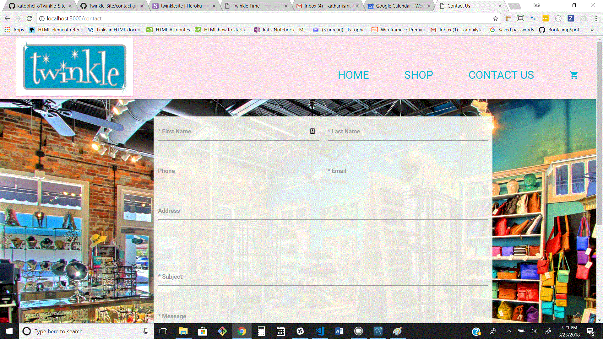

# Twinkle-Site

## Overview
Twinkle-Site is an on-line shopping site. Through Mysql and Sequelize we have incorporated Twinkle's inventory into a webpage and have set up payment options so people from all over the world can purchase Twinkle products.

### Utilising
* Node.js
* Express
* Body-Parser
* Ajax Calls
* API Routes
* MySql
* Sequelize
* Mocha and Chai - for testing

# Using Twinkle-Site
Users can order a Twinkle product by going to the shopping page and choosing an item.

They then pick a color and quantity and it is added to their cart.

Users are then directed to the cart page where they can put in their shipping and payment info.

Users can also contact the store with questions - once the form is filled out an email is sent to Twinkle with all the info as well as the question from the customer. The customers info is also saved in the Twinkle Databse for future marketing use.

 This app is setup to listen on a Heroku default port.

 https://twinklesite.herokuapp.com/
